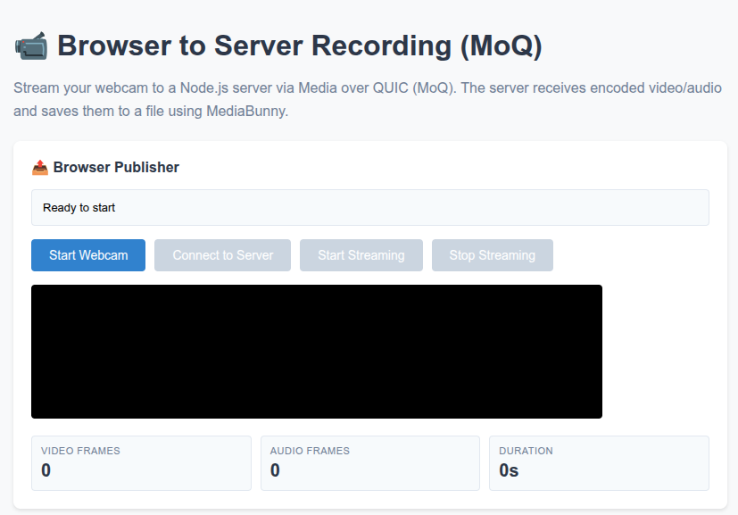

# Browser-to-Server Recording with MoQ

This demo showcases how the [@moq/net](https://www.npmjs.com/package/@moq/net) package can be used in server environments, specifically to record webcam video from a browser to a Node/Bun/Deno server using **Media over QUIC (MoQ)** as the transport layer.




## Overview

This demo uses a MoQ relay as an intermediary:

```
Browser (Publisher) → MoQ Relay ← Js Server (Subscriber)
```

Both the browser and server connect to a MoQ relay, allowing them to communicate without direct connections. The server subscribes to the broadcast and records incoming video/audio frames to an MP4 file using MediaBunny.

## Architecture

### Browser (Publisher)
- Captures webcam video/audio using `getUserMedia()`
- Encodes frames with WebCodecs (H.264 video, Opus audio)
- Publishes to MoQ relay using `@moq/net`
- Provides catalog with codec configuration

### Server (Subscriber)
- Connects to same MoQ relay using `@moq/net`
- Subscribes to video and audio tracks
- Receives encoded frames from relay
- Writes frames to MP4 file using MediaBunny

### Hang format
Media is sent in the [Hang](https://doc.moq.dev/concept/hang) format ([spec](https://doc.moq.dev/draft/moq-hang)), implemented by hand in [`src/moq/hang.ts`](../moq/hang.ts) and shared with the browser demos:
- **Catalog** (`catalog.json`): one JSON frame per group, listing each rendition's WebCodecs decoder config (`description` is hex) with `container: { kind: "legacy" }`, plus a `clock` mapping PTS zero to wall time
- **Video track**: one group per GoP, starting with a keyframe and ending with an empty end-of-frame marker
- **Audio track**: each audio chunk is its own group
- **Frame format** (legacy container): `[timestamp, QUIC varint in microseconds] [codec payload]`
- **Broadcast name**: `server-recording.hang`

More details [here](https://webcodecsfundamentals.org/patterns/live-streaming/#hang-format)
## Setup

### Prerequisites

```bash
npm install
```

**Key dependencies:**
- `@moq/net` - MoQ client library (works in browser and Node.js)
- `mediabunny` - MP4 muxing library
- `express` - Web server for hosting the UI
- `ws` - WebSocket polyfill, only needed on Node versions older than 21

### WebSockets on the server

Node, Bun and Deno don't have WebTransport, so `@moq/net` connects to the relay over WebSockets instead. Node 21+ and Bun have `WebSocket` built in; on older Node, polyfill it **before** importing `@moq/net`:

```javascript
import WebSocket from 'ws';
globalThis.WebSocket = WebSocket;
```

## Usage

### 1. Start the server

```bash
npm run subscriber
```

The recorder imports `../moq/hang.ts` directly, using Node's type stripping (Node 22.6+; on by default from Node 23.6). Set `PORT` or `BROADCAST` to override the defaults.

This starts:
- Express server on `http://localhost:3000`
- MoQ subscriber connecting to relay
- Waits for broadcast named `server-recording`

### 2. Open the browser

Navigate to `http://localhost:3000/upload.html`

The page loads `MoqPublisher` from the published `webcodecs-examples` package. To test local changes to the library, run `npm run build` at the repo root and open `http://localhost:3000/upload.html?local` instead.

### 3. Record

1. Click **Start Webcam** - Request camera/microphone access
2. Click **Connect to Server** - Connect to MoQ relay and publish broadcast
3. Click **Start Streaming** - Server starts recording, frames begin flowing
4. Click **Stop Streaming** - Server stops and saves recording to `recordings/`

The MP4 file will be saved as `recordings/recording-[timestamp].mp4`.

